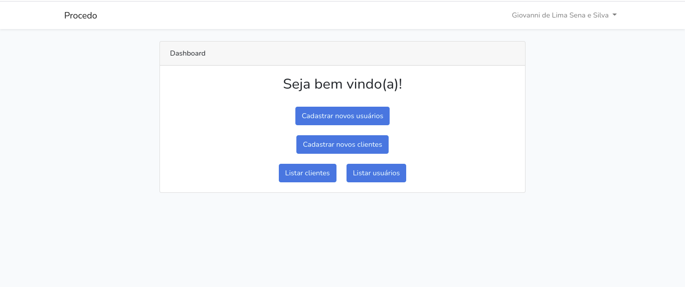

  

  <b>Desafio Procedo.</b>

 

## Conteúdo

- [Sobre](#sobre)
- [Tecnologias](#tecnologias)
- [Pré-requisitos](#pre-requisitos)
- [Como usar](#como-usar)
- [Como contibuir](#como-contribuir)

## :bookmark: Sobre

Tela de registro e cadastro de usuários e clientes, contendo um dashboard para listagem dos mesmos

## :rocket: Tecnologias Utilizadas

O projeto foi desenvolvido utilizando as seguintes tecnologias

- [Laravel](https://laravel.com/)
- [Banco de dados relacional - Mysql](https://www.mysql.com/)

## :zap: Como usar

- Faça um clone desse repositório: 
`git clone https://github.com/Giovanni-786/ignews.git`

- Instale as dependências: `composer install --prefer-dist`
- Inserir as variáveis de ambiente no arquivo .env
- Rodar as migrations: `php artisan migrate`
- Gerar a key do projeto: `php artisan key:generate`
- Inicie a aplicação:
    - Rode o comando de inicialização: `php artisan serve`

<a href="https://www.linkedin.com/in/giovanni-sena/">Giovanni Lima</a></h4>
